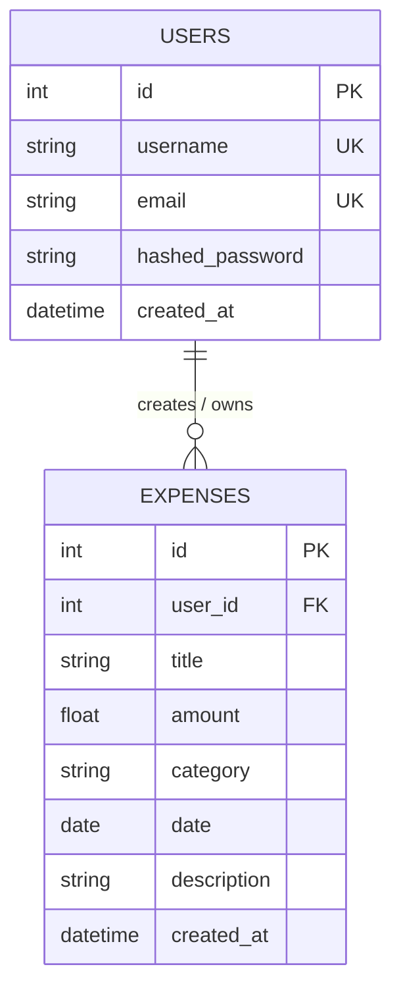

# 💰 Personal Expense Tracker

A full-stack personal finance and expense tracking application built for **Nolyth Sprint 01: Backend Foundations**. This project demonstrates practical Python engineering, RESTful API architecture with **FastAPI**, relational database persistence with **SQLite** and **SQLAlchemy**, request/response data validation with **Pydantic**, secure authentication via **JWT**, and an interactive frontend built with **Streamlit**.

---

## 📌 Project Overview

Managing personal expenses is a crucial daily task. This application solves the problem by providing a clean, authenticated environment where users can:
- **Record & Categorize Expenses**: Log daily expenditures with titles, categories, dates, amounts, and custom notes.
- **Filter & Search**: Quickly find transactions using category filters, date ranges, or keyword searches.
- **Analyze Spending**: View KPI metrics (Total Spent, Transaction Counts, Average Cost, Top Category) and visual spending distributions.
- **Manage Entries (CRUD)**: Update existing expenses or delete entries with immediate database persistence.
- **Multi-User Security**: Keep user data completely isolated using JWT token-based authentication.

---

## 🏗️ Architecture & Tech Stack

| Layer | Technology | Purpose |
|---|---|---|
| **Backend API** | [FastAPI](https://fastapi.tiangolo.com/) | High-performance RESTful API endpoints, dependency injection, and automatic OpenAPI docs. |
| **Data Validation** | [Pydantic v2](https://docs.pydantic.dev/) | Strict request payload validation, type hints, and response serialization. |
| **Database & ORM** | [SQLite](https://www.sqlite.org/) + [SQLAlchemy](https://www.sqlalchemy.org/) | Relational database persistence, connection pooling, and ORM model mapping. |
| **Authentication** | [PyJWT](https://pyjwt.readthedocs.io/) + PBKDF2 Hashing | Secure password salting/hashing and Bearer token session authentication. |
| **Frontend UI** | [Streamlit](https://streamlit.io/) + [Pandas](https://pandas.pydata.org/) | User-friendly dashboard with forms, data tables, metrics, and charts. |

---

## 📂 Project Structure

```text
Sprint_1_Nolyth/
│
├── backend/                        # Backend Application Package
│   ├── __init__.py
│   ├── database.py                 # SQLite engine, SessionLocal, and DB dependency
│   ├── models.py                   # SQLAlchemy ORM models (User, Expense)
│   ├── schemas.py                  # Pydantic schemas for request/response validation
│   ├── auth.py                     # Password hashing, JWT token creation & verification
│   ├── crud.py                     # Database query helper functions (CRUD logic)
│   └── routers/
│       ├── __init__.py
│       ├── auth_router.py          # /auth/register, /auth/login, /auth/me
│       └── expense_router.py       # /expenses CRUD, search, filter, and summary
│
├── frontend/                       # Frontend Application Package
│   ├── __init__.py
│   └── app.py                      # Streamlit UI with multi-view navigation & charts
│
├── test_backend.py                 # Automated end-to-end integration tests
├── main.py                         # FastAPI application entry point
├── requirements.txt                # Python project dependencies
├── expenses.db                     # SQLite database file (auto-generated)
└── README.md                       # Complete project documentation and guide
```

---

## ⚙️ Setup and Installation

### 1. Prerequisites
- Python 3.10+ installed on your computer.
- Git installed.

### 2. Clone Repository & Setup Virtual Environment

```bash
# Clone the repository
git clone <your-github-repo-url>
cd Sprint_1_Nolyth

# Create a virtual environment
python -m venv .venv

# Activate virtual environment
# On Windows (PowerShell):
.\.venv\Scripts\Activate.ps1
# On Windows (Command Prompt):
.\.venv\Scripts\activate.bat
# On macOS / Linux:
source .venv/bin/activate
```

### 3. Install Dependencies

```bash
pip install -r requirements.txt
```

---

## 🚀 Running the Application

This application consists of two services: the **FastAPI Backend** and the **Streamlit Frontend**.

### Step 1: Start the FastAPI Backend

Open your **first terminal** in the project directory:

**Option A (Activate venv first):**
- In Command Prompt (`cmd`):
  ```cmd
  .venv\Scripts\activate.bat
  uvicorn main:app --reload
  ```
- In PowerShell:
  ```powershell
  .\.venv\Scripts\Activate.ps1
  uvicorn main:app --reload
  ```

**Option B (Run directly without activating):**
```cmd
.\.venv\Scripts\python.exe main.py
```

- API Base URL: **`http://127.0.0.1:8000`**
- Interactive Swagger Docs: **`http://127.0.0.1:8000/docs`**

---

### Step 2: Start the Streamlit Frontend

Open a **second terminal window** in the same folder:

**Option A (Activate venv first):**
- In Command Prompt (`cmd`):
  ```cmd
  .venv\Scripts\activate.bat
  streamlit run frontend/app.py
  ```
- In PowerShell:
  ```powershell
  .\.venv\Scripts\Activate.ps1
  streamlit run frontend/app.py
  ```

**Option B (Run directly using the virtual environment):**
```cmd
.\.venv\Scripts\python.exe -m streamlit run frontend/app.py
```
*(or `.\.venv\Scripts\streamlit.exe run frontend/app.py`)*

- Streamlit will open your browser at: **`http://localhost:8501`**

---

## 🔑 User Flow & Features

1. **Register**: Go to the **Create Account** tab, enter a username, email, and password. Form validations verify input lengths and password matching.
2. **Login**: Enter your credentials in the **Sign In** tab to receive your secure JWT token.
3. **Dashboard**: View summary KPI metrics (Total Spent, Total Transactions, Average Transaction, Top Category) and breakdown charts.
4. **Add Expense**: Fill out the form with a Title, Amount (strictly > $0), Category, Date, and optional Notes.
5. **Manage Expenses**:
   - Filter by Category (Food & Dining, Transportation, Shopping, etc.).
   - Filter by Date Range (From Date -> To Date).
   - Search by keyword in Title or Notes.
   - Select any expense ID to **Edit** its details or **Delete** it permanently.

---

## 🛡️ Input Validation & Form Validations

| Field | Validation Rules | Implemented At |
|---|---|---|
| **Username** | Minimum 3 non-whitespace characters, unique across all users | Frontend & Pydantic Schema |
| **Email** | Valid email structure (`user@domain.com`), unique in database | Frontend & Pydantic `EmailStr` |
| **Password** | Minimum 6 characters, confirmation matching | Frontend Form & Backend Auth |
| **Expense Title** | Non-empty, 1-100 characters, whitespace stripped | Frontend & Pydantic `@field_validator` |
| **Expense Amount** | Positive float (`gt=0`), minimum $0.01 | Frontend input & Pydantic `Field(..., gt=0)` |
| **Expense Date** | Valid ISO Date (`YYYY-MM-DD`) | Streamlit date picker & Pydantic `date` |
| **Expense Category** | Non-empty, chosen from standard categories | Frontend Selectbox & Pydantic validator |

---

## 📡 API Endpoints Reference

### Authentication Endpoints (`/auth`)

| Method | Endpoint | Description | Auth Required | Status Code |
|---|---|---|:---:|:---:|
| `POST` | `/auth/register` | Create a new user account | No | `201 Created` |
| `POST` | `/auth/login` | Authenticate user and receive JWT access token | No | `200 OK` |
| `GET` | `/auth/me` | Fetch currently logged-in user profile | **Yes (Bearer)** | `200 OK` |

### Expense Management Endpoints (`/expenses`)

| Method | Endpoint | Description | Auth Required | Status Code |
|---|---|---|:---:|:---:|
| `POST` | `/expenses/` | Create a new expense | **Yes (Bearer)** | `201 Created` |
| `GET` | `/expenses/` | List expenses (with category, date, search filters) | **Yes (Bearer)** | `200 OK` |
| `GET` | `/expenses/summary` | Aggregated analytics & category breakdown | **Yes (Bearer)** | `200 OK` |
| `GET` | `/expenses/categories/list` | Get list of predefined categories | No | `200 OK` |
| `GET` | `/expenses/{id}` | Get details of a single expense by ID | **Yes (Bearer)** | `200 OK` |
| `PUT` | `/expenses/{id}` | Update an existing expense by ID | **Yes (Bearer)** | `200 OK` |
| `DELETE` | `/expenses/{id}` | Delete an expense by ID | **Yes (Bearer)** | `200 OK` |

---

## 🗄️ Database Schema Design

The SQLite database (`expenses.db`) implements a clean relational schema using SQLAlchemy ORM:



- **Relationships**: `User.expenses` has a one-to-many relationship with `Expense.owner`.
- **Cascade Deletion**: If a user is deleted, all their associated expenses are safely removed (`cascade="all, delete-orphan"`).
- **Data Isolation**: Each user can only view, edit, or delete expenses linked to their own `user_id`.

---

## 🧪 Running Automated Tests

Run the test suite to verify all endpoints, database operations, and validations:

```bash
python test_backend.py
```

All integration tests run against an in-memory/test database ensuring zero corruption of your production data.

---

## 💡 Review Q&A Cheat Sheet (For Live Session 02)

1. **Why use FastAPI over standard Flask?**
   - FastAPI natively provides asynchronous request handling, automatic interactive documentation via OpenAPI/Swagger (`/docs`), and built-in Pydantic data validation with clear HTTP status codes.
2. **How does authentication work?**
   - When a user logs in with their username and password, the password is verified against a PBKDF2-HMAC-SHA256 salted hash. Upon verification, the server generates a signed JSON Web Token (JWT) with an expiration timestamp. The frontend stores this token in session state and sends it in the `Authorization: Bearer <token>` header on subsequent requests.
3. **Why separate routers, models, schemas, and crud?**
   - Separation of concerns: `models.py` defines database tables, `schemas.py` validates incoming and outgoing HTTP data, `crud.py` isolates SQL queries, and `routers/` handle HTTP route definitions and status codes. This keeps the code modular, readable, and easy to maintain.
