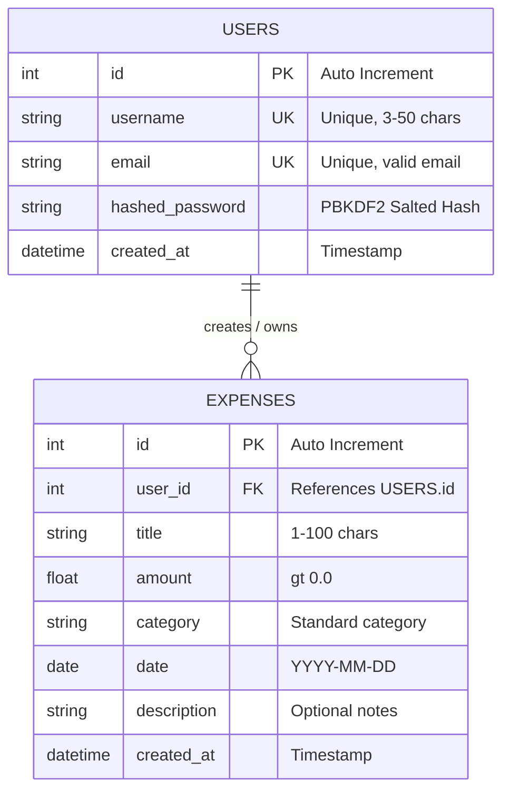

#  Personal Expense Tracker

[](https://python.org)
[](https://fastapi.tiangolo.com/)
[](https://sqlite.org)
[](https://www.sqlalchemy.org/)
[](https://streamlit.io)
[](https://docs.pydantic.dev/)
[](https://jwt.io)

> **Submission for Nolyth Sprint 01: Backend Foundations**  
> A full-stack, authenticated personal expense tracking application featuring a high-performance **FastAPI** REST backend, **SQLite** & **SQLAlchemy** ORM persistence, strict **Pydantic v2** validation, and an interactive **Streamlit** dashboard.

---

##  Live Application (Instant Cloud Evaluation)

The application is deployed live on Streamlit Community Cloud with an integrated backend runner:

[**Launch Live Streamlit App**](https://sprint1nolyth-sndoasdwhw4mx2trg9ofej.streamlit.app/)

> [!TIP]
> **No installation required for instant grading:** The cloud deployment includes an embedded backend supervisor that runs FastAPI in the background. Reviewers can register an account, log in, create expenses, filter records, and inspect analytics directly in the browser.

---

##  Quick Evaluation Walkthrough (2-Minute Test Flow)

To quickly test all core requirements of Sprint 01, follow this recommended sequence:

1. **Register a User Account**:
   - Open the web application (locally at `http://localhost:8501` or via the [Live App](https://sprint1nolyth-sndoasdwhw4mx2trg9ofej.streamlit.app/)).
   - Switch to the **Create Account** tab.
   - Enter a username (e.g. `evaluator`), valid email (`evaluator@test.com`), and password. Click **Create Account**.
2. **Sign In (JWT Authentication)**:
   - Switch to the **Sign In** tab and enter your credentials.
   - Click **Sign In**. The session securely stores the issued JWT Bearer token.
3. **Create an Expense Entry**:
   - Navigate to **Add Expense** in the sidebar.
   - Enter a title (e.g. `Team Lunch`), amount (`45.50`), category (`Food & Dining`), transaction date, and optional notes.
   - Click **Save Expense** and verify the confirmation message.
4. **Inspect Analytics & Visualizations**:
   - Go to **Dashboard** in the sidebar.
   - Review live KPI metric cards: Total Spent, Total Transactions, Average Spend, Top Category.
   - Check the reactive Category Distribution bar chart and recent transactions table.
5. **Filter, Search & Manage (CRUD Operations)**:
   - Go to **Manage Expenses** in the sidebar.
   - Filter by Category (e.g. `Food & Dining`), Date Range, or Keyword Search (e.g. `Lunch`).
   - Select the expense from the edit dropdown, change an amount or title, and click **Update Expense**.
   - Test deleting an entry and confirm instant removal from the list and database.
6. **Inspect Interactive API Documentation**:
   - Open `http://127.0.0.1:8000/docs` in your browser.
   - Explore and execute any endpoint directly using Swagger UI's interactive "Try it out" feature.

---

##  Local Setup & Running Instructions

### 1. Prerequisites
- **Python 3.10+** installed on your system ([python.org](https://www.python.org/downloads/)).
- **Git** installed ([git-scm.com](https://git-scm.com/)).

### 2. Clone the Repository & Setup Virtual Environment

```bash
# Clone the repository
git clone https://github.com/ARKhalid123/Sprint_1_Nolyth.git
cd Sprint_1_Nolyth

# Create a virtual environment
python -m venv .venv

# Activate virtual environment:
# On Windows (PowerShell):
.\.venv\Scripts\Activate.ps1

# On Windows (Command Prompt):
.\.venv\Scripts\activate.bat

# On macOS / Linux:
source .venv/bin/activate
```

### 3. Install Dependencies

```bash
pip install -r requirements.txt
```

---

### 4. Running the Application

You can start the project using either of the two methods below:

#### Method 1: One-Command Quick Run (Recommended for Reviewers)

The Streamlit frontend contains an automated backend supervisor (`ensure_backend_running`) that automatically starts the FastAPI server on port `8000` in the background if it is not already running.

Run a single command in your terminal:

```bash
streamlit run frontend/app.py
```

- **Frontend Dashboard:** Opens automatically at `http://localhost:8501`
- **FastAPI Backend:** Runs concurrently at `http://127.0.0.1:8000`
- **Interactive Swagger Docs:** Accessible at `http://127.0.0.1:8000/docs`

---

#### Method 2: Dual-Terminal Run (Full Developer Mode)

For independent process monitoring, hot-reloading, or inspecting backend console logs:

**Terminal 1 — Start the FastAPI Backend:**
```bash
uvicorn main:app --reload
```
*(or run: `python main.py`)*
- Backend API: `http://127.0.0.1:8000`
- Interactive Swagger UI: `http://127.0.0.1:8000/docs`
- ReDoc Documentation: `http://127.0.0.1:8000/redoc`

**Terminal 2 — Start the Streamlit Frontend:**
```bash
streamlit run frontend/app.py
```
- Frontend UI: `http://localhost:8501`

---

##  Key Features & Overview

- **User Authentication & Data Privacy**: Secure account registration and login using PBKDF2 password hashing (100,000 iterations with unique salt) and stateless JWT Bearer token sessions. Every user's expenses are strictly isolated by their `user_id`.
- **Complete Expense Lifecycle (CRUD)**: Create, Read, Update, and Delete expense entries with title, amount, category, date, and description notes.
- **Dynamic Analytics Dashboard**: Real-time KPI summary metrics (Total Spent, Total Transactions, Average Spend, Top Category), spending breakdown bar charts, and tabular transaction feeds.
- **Multi-Parametric Search & Filtering**: Query expenses by category, custom date range (From Date to To Date), and keyword text search across titles and notes.
- **Dual-Layer Input Validation**: Client-side form guards combined with server-side Pydantic v2 schemas to reject negative amounts, invalid emails, empty strings, and malformed dates.
- **Automated API Documentation**: Interactive OpenAPI/Swagger documentation generated directly from FastAPI type definitions at `/docs`.

---

##  Architecture & Tech Stack

```text
+-------------------------------------------------------------+
|                   Streamlit Web Frontend                    |
|   - Reactive Dashboard UI      - Auth Forms (Login/Register)|
|   - KPI Metrics & Bar Charts   - Expense Management Forms   |
+------------------------------+------------------------------+
                               | HTTP / JSON (Bearer Token)
+------------------------------v------------------------------+
|                    FastAPI REST Backend                     |
|   - Modular APIRouter          - Dependency Injection (Auth)|
|   - Pydantic v2 Serialization  - OpenAPI / Swagger Docs     |
+------------------------------+------------------------------+
                               | SQLAlchemy 2.0 ORM
+------------------------------v------------------------------+
|                    SQLite Relational DB                     |
|   - Users Table                - Expenses Table             |
|   - Foreign Key Cascade        - Strict Data Isolation      |
+-------------------------------------------------------------+
```

| Layer | Technology | Key Responsibility |
|---|---|---|
| **Backend API** | [FastAPI](https://fastapi.tiangolo.com/) | RESTful routes, dependency injection, async request handling, auto OpenAPI generation. |
| **Data Validation** | [Pydantic v2](https://docs.pydantic.dev/) | Strict request payload validation, type coercion, field constraints, response schemas. |
| **Database & ORM** | [SQLite](https://www.sqlite.org/) + [SQLAlchemy](https://www.sqlalchemy.org/) | Relational database persistence, connection pooling, model definitions, cascading relationships. |
| **Authentication** | [PyJWT](https://pyjwt.readthedocs.io/) + PBKDF2 | SHA-256 password salting/hashing and stateless Bearer token authorization. |
| **Frontend UI** | [Streamlit](https://streamlit.io/) + [Pandas](https://pandas.pydata.org/) | Interactive responsive dashboard with forms, metrics, tables, and charts. |

---

##  Project Structure

```text
Sprint_1_Nolyth/
│
├── backend/                        # Backend Application Package
│   ├── __init__.py
│   ├── database.py                 # SQLite engine, SessionLocal, and DB dependency
│   ├── models.py                   # SQLAlchemy ORM models (User, Expense)
│   ├── schemas.py                  # Pydantic v2 schemas for request/response validation
│   ├── auth.py                     # Password hashing, JWT creation & token verification
│   ├── crud.py                     # Database query helper functions (CRUD logic)
│   └── routers/
│       ├── __init__.py
│       ├── auth_router.py          # /auth/register, /auth/login, /auth/me
│       └── expense_router.py       # /expenses CRUD, search, filter, and analytics summary
│
├── frontend/                       # Frontend Application Package
│   ├── __init__.py
│   └── app.py                      # Streamlit UI with multi-view navigation & charts
│
├── main.py                         # FastAPI application entry point & CORS configuration
├── requirements.txt                # Python project dependencies
├── expenses.db                     # SQLite database file (auto-generated on startup)
└── README.md                       # Project documentation and evaluation guide
```

---

##  API Endpoints Reference

### Authentication Endpoints (`/auth`)

| Method | Endpoint | Description | Auth Required | Status Code |
|---|---|---|:---:|:---:|
| `POST` | `/auth/register` | Register a new user account | No | `201 Created` |
| `POST` | `/auth/login` | Authenticate with credentials and receive JWT access token | No | `200 OK` |
| `GET` | `/auth/me` | Fetch authenticated user profile details | **Yes (Bearer)** | `200 OK` |

### Expense Management Endpoints (`/expenses`)

| Method | Endpoint | Description | Auth Required | Status Code |
|---|---|---|:---:|:---:|
| `POST` | `/expenses/` | Create a new expense record | **Yes (Bearer)** | `201 Created` |
| `GET` | `/expenses/` | List expenses (with category, date range, search filters) | **Yes (Bearer)** | `200 OK` |
| `GET` | `/expenses/summary` | Fetch spending analytics KPIs and category breakdown | **Yes (Bearer)** | `200 OK` |
| `GET` | `/expenses/categories/list` | Fetch predefined expense category list | No | `200 OK` |
| `GET` | `/expenses/{id}` | Retrieve details of a specific expense by ID | **Yes (Bearer)** | `200 OK` |
| `PUT` | `/expenses/{id}` | Update an existing expense record by ID | **Yes (Bearer)** | `200 OK` |
| `DELETE` | `/expenses/{id}` | Delete an expense record by ID | **Yes (Bearer)** | `200 OK` |

---

##  Input Validation & Security Measures

The project enforces synchronized validation at both the frontend UI and backend API layers:

| Field / Feature | Validation Rule | Enforcement Layer |
|---|---|---|
| **Username** | 3 to 50 characters, non-empty, whitespace stripped, unique in DB | Frontend Form & Pydantic `@field_validator` |
| **Email** | Valid RFC email structure (`user@domain.com`), unique per user | Frontend Form & Pydantic `EmailStr` |
| **Password** | Minimum 6 characters, confirmation matching | Frontend Form & Backend Auth |
| **Password Storage** | PBKDF2-HMAC-SHA256 with random salt (never stored in plaintext) | Backend `backend/auth.py` |
| **Session Security** | Stateless JWT Bearer token with expiration | FastAPI `OAuth2PasswordBearer` & PyJWT |
| **Expense Title** | Non-empty, 1-100 characters, whitespace stripped | Frontend & Pydantic `@field_validator` |
| **Expense Amount** | Positive float strictly greater than 0 (`gt=0`), minimum $0.01 | Frontend input & Pydantic `Field(..., gt=0)` |
| **Expense Date** | Valid ISO Date (`YYYY-MM-DD`) | Streamlit date picker & Pydantic `date` |
| **Expense Category** | Chosen from whitelist of standard categories | Frontend Selectbox & Pydantic validator |

---

##  Database Schema Design

The SQLite database (`expenses.db`) implements a clean relational schema mapped via SQLAlchemy ORM:



- **One-to-Many Relationship**: Each `User` can own multiple `Expense` records.
- **Strict Data Isolation**: Queries are filtered by the authenticated user's `user_id`. Users can never view, modify, or delete another user's records.
- **Cascade Deletion**: If a user account is deleted, all associated expense entries are safely removed (`cascade="all, delete-orphan"`).

---

##  Troubleshooting & FAQs

<details>
<summary><b>1. PowerShell gives "Script Execution Policy" error when activating virtual environment</b></summary>

By default, Windows PowerShell restricts script execution. You can bypass this policy for your current terminal session without affecting system-wide settings:
```powershell
Set-ExecutionPolicy -Scope Process -ExecutionPolicy Bypass
.\.venv\Scripts\Activate.ps1
```
</details>

<details>
<summary><b>2. "Port 8000 or 8501 is already in use"</b></summary>

If port `8000` or `8501` is already in use by another application:
- Start the FastAPI backend on a different port:
  ```bash
  uvicorn main:app --port 8080 --reload
  ```
- Point the Streamlit frontend to the new port:
  ```bash
  # Windows PowerShell:
  $env:API_BASE_URL="http://127.0.0.1:8080"
  streamlit run frontend/app.py --server.port 8502

  # macOS / Linux:
  export API_BASE_URL="http://127.0.0.1:8080"
  streamlit run frontend/app.py --server.port 8502
  ```
</details>

<details>
<summary><b>3. How do I reset the database to a fresh state?</b></summary>

All data is stored in the local SQLite database file `expenses.db` in the project root. To reset the database, simply delete `expenses.db` and re-run the application; all tables will be automatically recreated.
</details>

---

##  Submission Information

- **Project:** Personal Expense Tracker
- **Sprint:** Nolyth Sprint 01 — Backend Foundations
- **GitHub Repository:** [ARKhalid123/Sprint_1_Nolyth](https://github.com/ARKhalid123/Sprint_1_Nolyth)
- **Live Streamlit App:** [sprint1nolyth.streamlit.app](https://sprint1nolyth.streamlit.app/)
