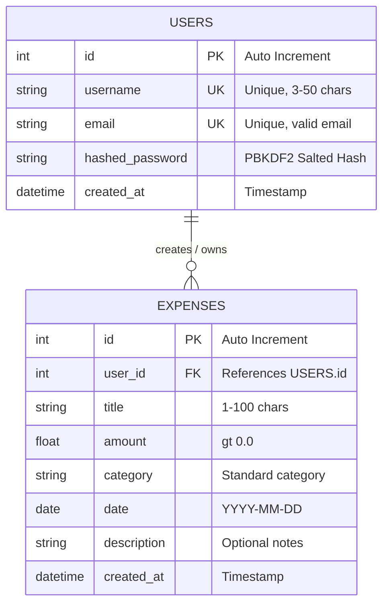

#  Personal Expense Tracker

[](https://python.org)
[](https://fastapi.tiangolo.com/)
[](https://sqlite.org)
[](https://www.sqlalchemy.org/)
[](https://streamlit.io)
[](https://docs.pydantic.dev/)
[](https://jwt.io)

> **Submission for Nolyth Sprint 01: Backend Foundations**  
> A full-stack, authenticated personal expense tracking application featuring a high-performance **FastAPI** REST backend, **SQLite** & **SQLAlchemy** ORM persistence, strict **Pydantic v2** validation, and an interactive **Streamlit** dashboard.

---

## 🌐 Live Application (Cloud Demo)

The project is hosted and ready to test live on Streamlit Community Cloud:

👉 **[Launch Live Streamlit Web App](https://sprint1nolyth.streamlit.app/)** *(or open the direct Streamlit deployment URL provided in the submission)*

> [!TIP]
> **No setup required for instant evaluation!** The cloud deployment features an embedded backend runner, allowing reviewers to test user registration, JWT login, expense entry, filtering, and analytics directly from any modern web browser.

---

## 📋 Table of Contents

- [Project Overview & Key Features](#-project-overview--key-features)
- [Architecture & Tech Stack](#-architecture--tech-stack)
- [Repository Structure](#-repository-structure)
- [Local Setup & Installation](#-local-setup--installation)
- [How to Run Locally](#-how-to-run-locally)
  - [Method 1: One-Command Quick Run (Recommended)](#method-1-one-command-quick-run-recommended-for-reviewers)
  - [Method 2: Standard Dual-Terminal Run (Full Developer Mode)](#method-2-standard-dual-terminal-run-full-developer-mode)
- [2-Minute Quick Evaluation Walkthrough](#-2-minute-quick-evaluation-walkthrough)
- [API Endpoints Reference](#-api-endpoints-reference)
- [Data Validation & Security](#-data-validation--security)
- [Database Schema Design](#-database-schema-design)
- [Troubleshooting & FAQs](#-troubleshooting--faqs)

---

## 💡 Project Overview & Key Features

Personal financial tracking is a vital daily utility. This project provides a production-grade full-stack solution with clear separation of concerns, robust security, and an intuitive user experience:

- 🔐 **Multi-User Security & JWT Authentication**: User accounts with PBKDF2-HMAC password hashing. Stateless JWT bearer tokens isolate all financial data strictly per user.
- 💳 **Full Expense Lifecycle (CRUD)**: Log daily expenses with titles, amounts, predefined categories, transaction dates, and custom notes. Real-time update and deletion with immediate database reflection.
- 📊 **Dynamic Analytics Dashboard**: Interactive KPI metrics (Total Spent, Total Transactions, Average Spend, Top Category), category distribution bar charts, and recent transaction feeds.
- 🔍 **Multi-Parametric Search & Filtering**: Instant querying by expense category, date ranges (from/to), and keyword search matching titles or notes.
- 🛡️ **Comprehensive Dual-Layer Validation**: Strict frontend validation coupled with backend Pydantic v2 schema enforcement (positive amounts, valid emails, non-empty whitespace-sanitized strings).
- 📖 **Interactive Swagger & OpenAPI Documentation**: Self-documenting API endpoints accessible out of the box at `/docs` and `/redoc`.

---

## 🏛️ Architecture & Tech Stack

```text
┌─────────────────────────────────────────────────────────────┐
│                   Streamlit Web Frontend                    │
│   • Reactive Dashboard UI      • Auth Forms (Login/Register)│
│   • KPI Metrics & Bar Charts   • Expense Management Forms   │
└──────────────────────────────┬──────────────────────────────┘
                               │ HTTP / JSON (Bearer Token)
┌──────────────────────────────▼──────────────────────────────┐
│                    FastAPI REST Backend                     │
│   • Modular APIRouter          • Dependency Injection (Auth)│
│   • Pydantic v2 Serialization  • OpenAPI / Swagger Docs     │
└──────────────────────────────┬──────────────────────────────┘
                               │ SQLAlchemy 2.0 ORM
┌──────────────────────────────▼──────────────────────────────┐
│                   SQLite Relational DB                      │
│   • User Accounts              • Expense Records            │
│   • Foreign Key Cascade        • Multi-Tenant Isolation     │
└─────────────────────────────────────────────────────────────┘
```

| Layer | Technology | Key Responsibility |
|---|---|---|
| **Backend API** | [FastAPI](https://fastapi.tiangolo.com/) | High-speed RESTful API, async request handling, modular routers, and auto OpenAPI docs. |
| **Data Validation** | [Pydantic v2](https://docs.pydantic.dev/) | Strict request payload validation, type coercion, field validators, and response schemas. |
| **Database & ORM** | [SQLite](https://www.sqlite.org/) + [SQLAlchemy](https://www.sqlalchemy.org/) | Relational persistence, connection pooling, model definitions, and declarative queries. |
| **Authentication** | [PyJWT](https://pyjwt.readthedocs.io/) + PBKDF2 | SHA-256 password salting/hashing and stateless Bearer token authentication. |
| **Frontend UI** | [Streamlit](https://streamlit.io/) + [Pandas](https://pandas.pydata.org/) | User-friendly dashboard with reactive state, dataframes, forms, and charts. |

---

## 📂 Repository Structure

```text
Sprint_1_Nolyth/
├── backend/                        # Backend Application Package
│   ├── __init__.py
│   ├── database.py                 # SQLite engine, SessionLocal, and DB dependency
│   ├── models.py                   # SQLAlchemy ORM models (User, Expense)
│   ├── schemas.py                  # Pydantic v2 schemas for request/response validation
│   ├── auth.py                     # Password hashing, JWT token creation & verification
│   ├── crud.py                     # Database query helper functions (CRUD logic)
│   └── routers/
│       ├── __init__.py
│       ├── auth_router.py          # /auth/register, /auth/login, /auth/me
│       └── expense_router.py       # /expenses CRUD, search, filter, and analytics summary
│
├── frontend/                       # Frontend Application Package
│   ├── __init__.py
│   └── app.py                      # Streamlit UI with multi-view navigation & charts
│
├── .devcontainer/                  # VS Code Dev Container / Codespaces config
│   └── devcontainer.json
├── main.py                         # FastAPI application entry point & CORS configuration
├── requirements.txt                # Python project dependencies
├── expenses.db                     # SQLite database file (auto-generated on startup)
└── README.md                       # Complete project documentation and guide
```

---

## ⚙️ Local Setup & Installation

Follow these steps to run the complete application locally on your machine.

### 1. Prerequisites
- **Python 3.10+** installed on your system ([python.org](https://www.python.org/downloads/)).
- **Git** installed ([git-scm.com](https://git-scm.com/)).

### 2. Clone the Repository

```bash
git clone https://github.com/ARKhalid123/Sprint_1_Nolyth.git
cd Sprint_1_Nolyth
```

### 3. Create a Virtual Environment

It is recommended to use an isolated Python virtual environment:

```bash
python -m venv .venv
```

### 4. Activate the Virtual Environment

Choose the command matching your operating system and shell:

- **Windows (PowerShell):**
  ```powershell
  .\.venv\Scripts\Activate.ps1
  ```
  *(If you get a script execution policy error, run `Set-ExecutionPolicy -Scope Process -ExecutionPolicy Bypass` first).*

- **Windows (Command Prompt `cmd`):**
  ```cmd
  .\.venv\Scripts\activate.bat
  ```

- **macOS / Linux:**
  ```bash
  source .venv/bin/activate
  ```

### 5. Install Dependencies

Install all required packages via `pip`:

```bash
pip install -r requirements.txt
```

---

## 🚀 How to Run Locally

You can run the application locally using either of the two methods below:

### Method 1: One-Command Quick Run (Recommended for Reviewers)

> [!NOTE]
> The Streamlit frontend includes an intelligent background runner (`ensure_backend_running`) that automatically boots the FastAPI backend on port `8000` if it is not already running!

Run a single command in your terminal:

```bash
streamlit run frontend/app.py
```

- **Streamlit Web Dashboard:** Open **`http://localhost:8501`** in your browser.
- **FastAPI Backend:** Runs simultaneously at **`http://127.0.0.1:8000`**.
- **Interactive Swagger Docs:** Accessible at **`http://127.0.0.1:8000/docs`**.

---

### Method 2: Standard Dual-Terminal Run (Full Developer Mode)

For granular control, live hot-reloading, or debugging backend logs, you can run the backend and frontend in separate terminals:

#### Terminal 1 — Start the FastAPI Backend:

```bash
# Make sure your virtual environment is activated
uvicorn main:app --reload
```
*Or run directly:*
```bash
python main.py
```

- **API Base URL:** `http://127.0.0.1:8000`
- **Interactive Swagger Docs:** `http://127.0.0.1:8000/docs`
- **ReDoc Documentation:** `http://127.0.0.1:8000/redoc`

#### Terminal 2 — Start the Streamlit Frontend:

Open a new terminal, activate `.venv`, and run:

```bash
streamlit run frontend/app.py
```

- **Frontend Dashboard:** Opens automatically at **`http://localhost:8501`**.

---

## ⏱️ 2-Minute Quick Evaluation Walkthrough

Follow this quick guide to test the end-to-end functionality:

1. **Create an Account**:
   - Navigate to the **Create Account** tab.
   - Enter a username (`evaluator`), email (`evaluator@test.com`), and a password (minimum 8 characters).
   - Click **Create Account** to register.
2. **Sign In**:
   - Switch to the **Sign In** tab, enter your credentials, and click **Sign In**.
   - Your session will authenticate and store your JWT access token.
3. **Log Expenses**:
   - Go to the **Add Expense** page from the sidebar.
   - Enter a title (e.g. `Office Supplies`), amount (`45.50`), choose a category (e.g. `Shopping & Groceries`), pick a date, and add notes.
   - Click **Save Expense** and verify the success notification.
4. **Inspect Analytics & Charts**:
   - Navigate to the **Dashboard** in the sidebar.
   - View updated KPI cards: Total Spent, Total Transactions, Average Transaction, and Top Category.
   - Examine the dynamic Category Distribution chart and recent expense log table.
5. **Filter, Search & Manage (CRUD)**:
   - Go to **Manage Expenses** in the sidebar.
   - Test filtering by **Category**, **Date Range**, or **Keyword Search**.
   - Select an expense by its ID from the dropdown to **Edit** (modify title/amount) or **Delete** the entry.
6. **Inspect Interactive API Docs**:
   - Open **`http://127.0.0.1:8000/docs`** in your browser.
   - Explore and execute any endpoint using Swagger UI's "Try it out" feature.

---

## 🔌 API Endpoints Reference

### Authentication Endpoints (`/auth`)

| Method | Endpoint | Description | Auth Required | Status Code |
|:---:|---|---|:---:|:---:|
| `POST` | `/auth/register` | Register a new user account | No | `201 Created` |
| `POST` | `/auth/login` | Authenticate with credentials and receive JWT access token | No | `200 OK` |
| `GET` | `/auth/me` | Fetch authenticated user profile | **Yes (Bearer)** | `200 OK` |

### Expense Management Endpoints (`/expenses`)

| Method | Endpoint | Description | Auth Required | Status Code |
|:---:|---|---|:---:|:---:|
| `POST` | `/expenses/` | Create a new expense record | **Yes (Bearer)** | `201 Created` |
| `GET` | `/expenses/` | List expenses (with category, date range, search filters) | **Yes (Bearer)** | `200 OK` |
| `GET` | `/expenses/summary` | Fetch spending analytics KPIs and category breakdown | **Yes (Bearer)** | `200 OK` |
| `GET` | `/expenses/categories/list` | Fetch predefined expense category list | No | `200 OK` |
| `GET` | `/expenses/{id}` | Retrieve details of an expense by ID | **Yes (Bearer)** | `200 OK` |
| `PUT` | `/expenses/{id}` | Update an existing expense record by ID | **Yes (Bearer)** | `200 OK` |
| `DELETE` | `/expenses/{id}` | Delete an expense record by ID | **Yes (Bearer)** | `200 OK` |

---

## 🛡️ Data Validation & Security

The project enforces synchronized validation at both the frontend UI and backend API layers:

| Field | Validation Rule | Enforcement Layer |
|---|---|---|
| **Username** | 3 to 50 characters, non-empty, whitespace stripped, globally unique | Frontend Form & Pydantic `@field_validator` |
| **Email** | Valid email RFC format (`user@domain.com`), unique per user | Frontend Form & Pydantic `EmailStr` |
| **Password** | Minimum 8 characters, confirmation matching | Frontend Form & Pydantic Schema |
| **Password Storage** | PBKDF2-HMAC-SHA256 with random salt (never plaintext) | Backend `backend/auth.py` |
| **Session Security** | JWT Bearer token with expiration | FastAPI `OAuth2PasswordBearer` & PyJWT |
| **Expense Title** | Non-empty, 1-100 characters, whitespace stripped | Frontend & Pydantic `@field_validator` |
| **Expense Amount** | Positive float strictly greater than 0 (`gt=0`), min $0.01 | Frontend & Pydantic `Field(..., gt=0)` |
| **Expense Date** | Valid ISO Date (`YYYY-MM-DD`) | Streamlit Date Picker & Pydantic `date` |
| **Expense Category** | Whitelist of predefined standard categories | Frontend Selectbox & Pydantic validator |

---

## 🗄️ Database Schema Design

The SQLite database (`expenses.db`) implements a clean relational schema mapped via SQLAlchemy ORM:



- **One-to-Many Relationship**: Each `User` can own multiple `Expense` records.
- **Strict Data Isolation**: SQL queries are scoped by the authenticated user's `user_id`. Users can never access or modify each other's expenses.
- **Cascade Deletion**: If a user is deleted, all their associated expense entries are safely removed (`cascade="all, delete-orphan"`).

---

## 🔧 Environment Configuration

The application works out of the box with default settings, but supports environment variable overrides:

| Variable | Default Value | Description |
|---|---|---|
| `API_BASE_URL` | `http://127.0.0.1:8000` | Target URL used by the Streamlit frontend to communicate with the FastAPI backend. |

To point the Streamlit frontend to an external or alternate backend:
```bash
# On Linux/macOS:
export API_BASE_URL="http://your-custom-backend-url"
streamlit run frontend/app.py

# On Windows (PowerShell):
$env:API_BASE_URL="http://your-custom-backend-url"
streamlit run frontend/app.py
```

---

## ❓ Troubleshooting & FAQs

<details>
<summary><b>1. PowerShell gives "Script Execution Policy" error when activating .venv</b></summary>

By default, Windows PowerShell restricts script execution. You can bypass this for the current terminal session without altering system-wide settings:
```powershell
Set-ExecutionPolicy -Scope Process -ExecutionPolicy Bypass
.\.venv\Scripts\Activate.ps1
```
</details>

<details>
<summary><b>2. "Port 8000 or 8501 is already in use"</b></summary>

If port `8000` or `8501` is being used by another service:
- Run FastAPI on a different port:
  ```bash
  uvicorn main:app --port 8080 --reload
  ```
- Then point Streamlit to the new port:
  ```bash
  $env:API_BASE_URL="http://127.0.0.1:8080"
  streamlit run frontend/app.py --server.port 8502
  ```
</details>

<details>
<summary><b>3. Where is database data stored?</b></summary>

All data is stored in the local SQLite database file `expenses.db` created in the project root. If you ever want a fresh, clean database for testing, simply delete `expenses.db` and re-run the application; it will automatically recreate empty tables.
</details>

---

## 👨‍💻 Project Submission Info

- **Project:** Personal Expense Tracker
- **Sprint:** Nolyth Sprint 01 — Backend Foundations
- **GitHub Repository:** [ARKhalid123/Sprint_1_Nolyth](https://github.com/ARKhalid123/Sprint_1_Nolyth)
- **Live Streamlit App:** [sprint1nolyth.streamlit.app](https://sprint1nolyth.streamlit.app/)
